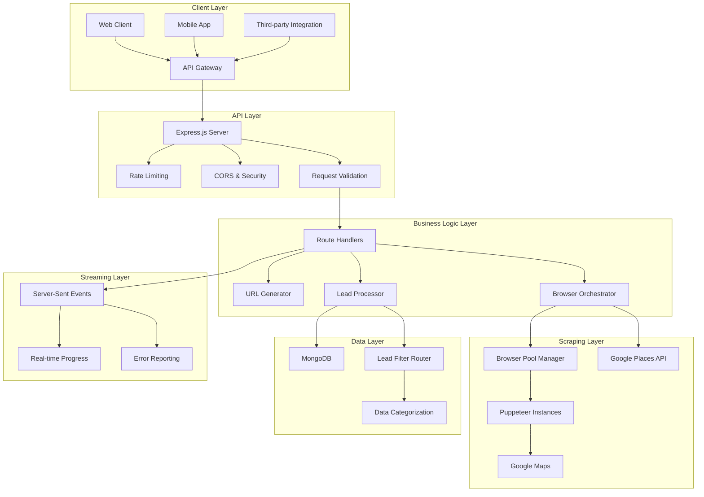
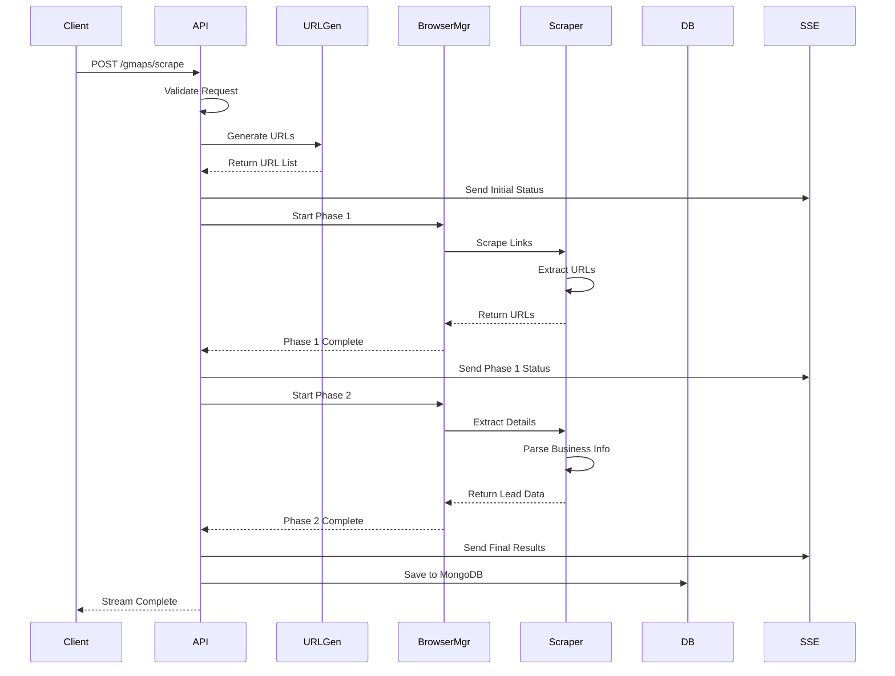
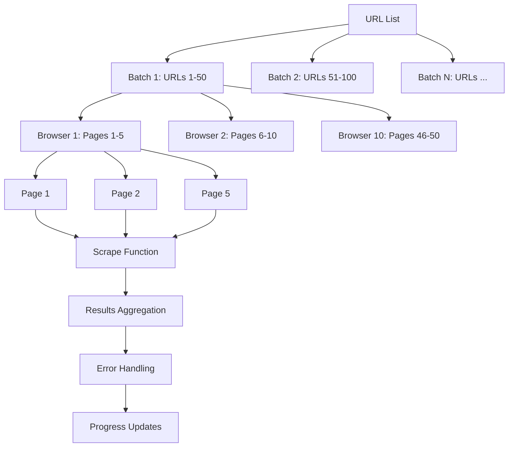
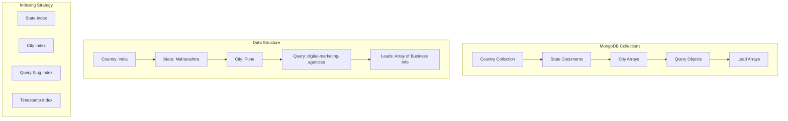
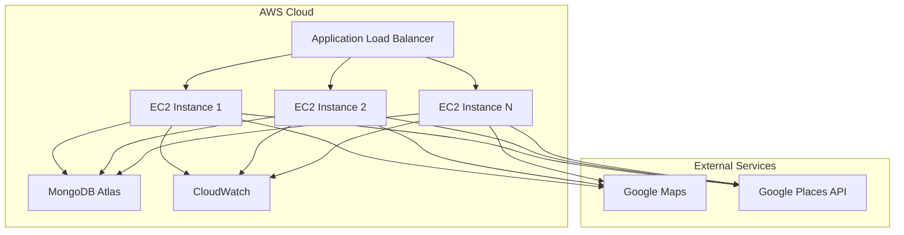

# Architecture Documentation

## System Overview

The Aixellabs Google Maps Scraping API is a high-performance, enterprise-grade system designed for extracting business information from Google Maps at scale. The architecture emphasizes concurrency, reliability, and real-time feedback through a sophisticated multi-layered design.

## High-Level Architecture



## Core Components

### 1. API Layer (`/src/apis/`)

#### GMAPS_SCRAPE.ts
The main web scraping endpoint that orchestrates the entire scraping process.

**Responsibilities:**
- Request validation using Zod schemas
- URL generation for multiple locations
- Two-phase scraping orchestration
- Server-Sent Events streaming
- Error handling and recovery

**Key Features:**
- **Phase 1**: Business listing URL collection
- **Phase 2**: Detailed business information extraction
- **Real-time Streaming**: Progress updates via SSE
- **Error Recovery**: Graceful handling of failures

#### GMAPS_SEARCH_API_SCRAPE.ts
Alternative scraping method using Google Places API.

**Responsibilities:**
- Google Places API integration
- Pagination handling
- Rate limiting compliance
- Data normalization

### 2. Browser Management (`/src/functions/common/`)

#### browser-batch-handler.ts
The core concurrency engine that manages multiple browser instances.

**Architecture:**
```typescript
interface BrowserBatchHandler {
  // Configuration
  MAX_BROWSER_SESSIONS: number;    // Default: 10
  MAX_PAGES_PER_BROWSER: number;   // Default: 5
  TOTAL_CONCURRENT_URLS: number;   // Calculated: 50
  
  // Processing Flow
  processBatches(): Promise<Result[]>;
  processSingleBrowser(): Promise<BrowserResult>;
  processBatchOfBrowsers(): Promise<BrowserResult[]>;
}
```

**Concurrency Model:**
- **Browser Pool**: Multiple isolated browser instances
- **Page Management**: Multiple pages per browser for efficiency
- **Batch Processing**: Sequential batches to manage resource usage
- **Resource Cleanup**: Automatic cleanup of browsers and pages

**Performance Optimizations:**
- **Request Interception**: Block unnecessary resources (images, CSS, fonts)
- **Memory Management**: Optimized browser arguments
- **Error Isolation**: Failures in one browser don't affect others
- **Progress Tracking**: Real-time progress updates

### 3. Scraping Functions (`/src/functions/`)

#### gmap-details-lead-extractor.ts
Extracts detailed business information from individual Google Maps pages.

**Data Extraction Process:**
1. **Page Navigation**: Navigate to business listing URL
2. **Request Interception**: Block unnecessary resources
3. **HTML Parsing**: Extract business information using JSDOM
4. **Data Normalization**: Standardize extracted data
5. **Error Handling**: Handle closed businesses and missing data

**Extracted Information:**
```typescript
interface TGoogleMapLeadInfo {
  website: string;        // Business website
  phoneNumber: string;    // Contact phone
  name: string;          // Business name
  gmapsUrl: string;      // Google Maps URL
  overAllRating: string; // Rating (e.g., "4.5")
  numberOfReviews: string; // Review count
}
```

#### scrape-links.ts
Collects business listing URLs from Google Maps search results.

**Process:**
1. **Search Navigation**: Navigate to Google Maps search
2. **Infinite Scroll**: Automatically scroll to load all results
3. **Link Extraction**: Extract business listing URLs
4. **Deduplication**: Remove duplicate URLs
5. **URL Normalization**: Ensure proper URL format

### 4. Utilities (`/src/utils/`)

#### browser.ts
Browser configuration and optimization for production environments.

**Optimization Features:**
- **Resource Blocking**: Disable images, CSS, fonts, analytics
- **Memory Optimization**: Configure memory limits and garbage collection
- **Security**: Disable unnecessary features and APIs
- **Performance**: Optimize rendering and JavaScript execution

**Configuration:**
```typescript
const optimisedBrowserArgs = [
  '--no-sandbox',
  '--disable-setuid-sandbox',
  '--disable-dev-shm-usage',
  '--disable-gpu',
  '--disable-images',
  '--memory-pressure-off',
  '--max-old-space-size=4096',
  // ... 80+ optimization flags
];
```

#### helpers.ts
URL generation and data formatting utilities.

**URL Generation Process:**
1. **Query Formatting**: Clean and format search queries
2. **Location Formatting**: Format city, state, country
3. **URL Construction**: Build Google Maps search URLs
4. **Encoding**: Proper URL encoding for special characters

#### lead-filter-router.ts
Intelligent lead categorization and routing system.

**Routing Logic:**
- **Contact Information Analysis**: Evaluate available contact methods
- **Priority Assignment**: Assign leads to appropriate outreach systems
- **Recursive Processing**: Suggest additional research steps
- **System Integration**: Route to email, phone, or social media systems

## Data Flow Architecture

### 1. Request Processing Flow



### 2. Browser Concurrency Model



### 3. Data Storage Architecture



## Performance Architecture

### 1. Concurrency Strategy

**Multi-Level Concurrency:**
- **Browser Level**: Multiple browser instances (default: 10)
- **Page Level**: Multiple pages per browser (default: 5)
- **Batch Level**: Sequential batches to manage resources
- **Request Level**: Concurrent processing within batches

**Resource Management:**
- **Memory Limits**: 4GB per browser instance
- **CPU Optimization**: Disabled unnecessary features
- **Network Optimization**: Request interception and blocking
- **Cleanup Strategy**: Automatic resource cleanup

### 2. Scalability Design

**Horizontal Scaling:**
- **Load Balancing**: Multiple API instances
- **Database Sharding**: MongoDB sharding by country/state
- **Browser Distribution**: Distribute browsers across instances
- **Caching Strategy**: Redis for frequently accessed data

**Vertical Scaling:**
- **Memory Optimization**: Efficient memory usage
- **CPU Optimization**: Multi-core utilization
- **I/O Optimization**: Async/await patterns
- **Network Optimization**: Connection pooling

### 3. Error Handling Architecture

**Multi-Layer Error Handling:**
```typescript
interface ErrorHandlingStrategy {
  // Browser Level
  browserErrors: {
    launch: 'retry with different config';
    navigation: 'skip URL and continue';
    parsing: 'log error and return empty data';
  };
  
  // Page Level
  pageErrors: {
    timeout: 'retry with longer timeout';
    network: 'retry with exponential backoff';
    parsing: 'log error and continue';
  };
  
  // System Level
  systemErrors: {
    memory: 'cleanup and restart browsers';
    database: 'retry with connection pool';
    rateLimit: 'wait and retry';
  };
}
```

## Security Architecture

### 1. API Security

**Request Validation:**
- **Schema Validation**: Zod schemas for all inputs
- **Rate Limiting**: IP-based rate limiting
- **CORS Configuration**: Configurable origin restrictions
- **Input Sanitization**: XSS and injection prevention

**Response Security:**
- **Helmet.js**: Security headers
- **Error Sanitization**: No sensitive data in errors
- **CORS Headers**: Proper cross-origin configuration

### 2. Browser Security

**Sandbox Configuration:**
- **No Sandbox**: Disabled for containerized environments
- **Setuid Sandbox**: Disabled for security
- **Dev SHM**: Disabled to prevent memory issues
- **GPU**: Disabled for server environments

**Resource Blocking:**
- **Analytics**: Block Google Analytics and tracking
- **Social Media**: Block Facebook, Twitter trackers
- **Images/CSS**: Block unnecessary resources
- **JavaScript**: Selective JavaScript execution

### 3. Data Security

**Database Security:**
- **Connection Encryption**: TLS/SSL connections
- **Authentication**: MongoDB authentication
- **Access Control**: Role-based access control
- **Data Validation**: Input validation at database level

## Monitoring and Observability

### 1. Logging Architecture

**Structured Logging:**
```typescript
interface LogEntry {
  timestamp: string;
  level: 'info' | 'warn' | 'error';
  component: string;
  operation: string;
  data: any;
  duration?: number;
  success: boolean;
}
```

**Log Categories:**
- **Application Logs**: Business logic events
- **Browser Logs**: Puppeteer operations
- **Database Logs**: MongoDB operations
- **Network Logs**: HTTP requests/responses
- **Performance Logs**: Timing and metrics

### 2. Metrics Collection

**Key Metrics:**
- **Request Rate**: Requests per second
- **Success Rate**: Successful scraping percentage
- **Response Time**: API response times
- **Browser Performance**: Browser launch and operation times
- **Memory Usage**: Browser and Node.js memory consumption
- **Database Performance**: Query times and connection pool status

### 3. Health Monitoring

**Health Checks:**
- **API Health**: Basic endpoint availability
- **Browser Health**: Browser launch capability
- **Database Health**: MongoDB connectivity
- **Resource Health**: Memory and CPU usage
- **Network Health**: External service connectivity

## Deployment Architecture

### 1. Container Architecture

**Docker Configuration:**
```dockerfile
FROM node:18-alpine
RUN apk add --no-cache chromium
WORKDIR /app
COPY package*.json pnpm-lock.yaml ./
RUN npm install -g pnpm && pnpm install
COPY . .
RUN pnpm run build
EXPOSE 8100
CMD ["pnpm", "run", "start"]
```

**Container Optimization:**
- **Multi-stage Build**: Optimized image size
- **Alpine Linux**: Minimal base image
- **Chromium Installation**: Pre-installed browser
- **Non-root User**: Security best practices

### 2. Cloud Architecture

**AWS Deployment:**


### 3. Scaling Strategy

**Auto-scaling Configuration:**
- **CPU-based Scaling**: Scale based on CPU utilization
- **Memory-based Scaling**: Scale based on memory usage
- **Request-based Scaling**: Scale based on request volume
- **Custom Metrics**: Scale based on scraping success rate

**Load Balancing:**
- **Round Robin**: Distribute requests evenly
- **Least Connections**: Route to least busy instance
- **Health Checks**: Remove unhealthy instances
- **Session Affinity**: Maintain browser sessions

## Future Architecture Considerations

### 1. Microservices Migration

**Service Decomposition:**
- **API Gateway Service**: Request routing and authentication
- **Scraping Service**: Core scraping functionality
- **Data Service**: Data processing and storage
- **Notification Service**: Real-time updates and alerts
- **Analytics Service**: Metrics and reporting

### 2. Event-Driven Architecture

**Event Streaming:**
- **Apache Kafka**: Event streaming platform
- **Event Sourcing**: Store all events for replay
- **CQRS**: Separate read and write models
- **Saga Pattern**: Distributed transaction management

### 3. Advanced Caching

**Multi-Level Caching:**
- **Browser Cache**: Cache scraped data in browsers
- **Redis Cache**: In-memory caching layer
- **CDN Cache**: Geographic distribution
- **Database Cache**: Query result caching

### 4. Machine Learning Integration

**Intelligent Features:**
- **Lead Scoring**: ML-based lead quality assessment
- **Duplicate Detection**: ML-based duplicate identification
- **Content Classification**: Automatic business categorization
- **Predictive Scaling**: ML-based resource scaling

This architecture provides a solid foundation for a scalable, reliable, and maintainable Google Maps scraping system that can handle enterprise-level workloads while maintaining high performance and reliability.