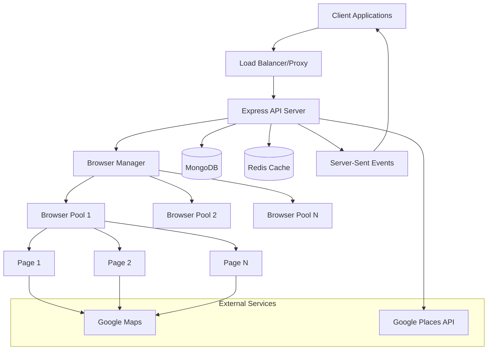
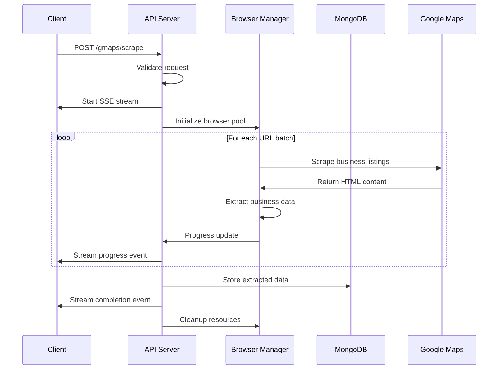
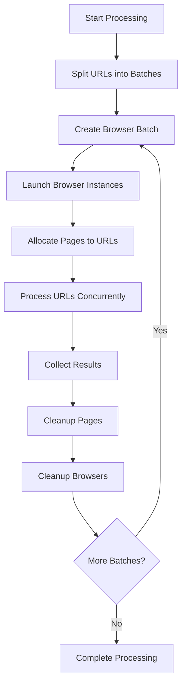
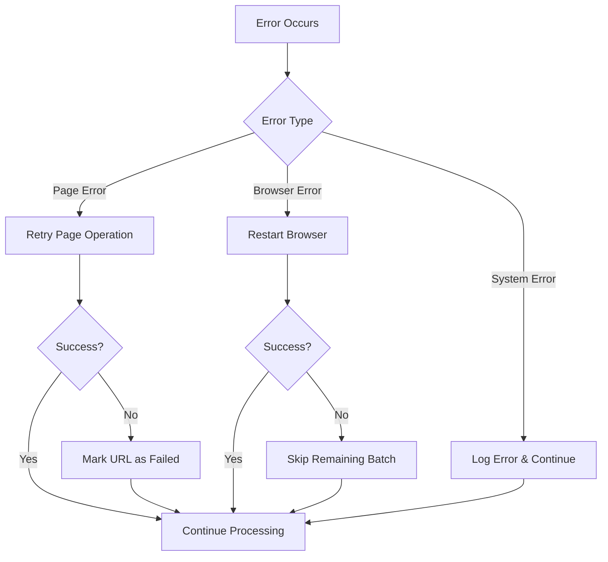

# System Architecture

## Overview

AixelLabs is a distributed web scraping system designed for high-volume Google Maps business data extraction. The architecture emphasizes scalability, reliability, and real-time progress reporting.

## High-Level Architecture



## Core Components

### 1. Express API Server (`src/index.ts`)

**Responsibilities:**
- HTTP request handling and routing
- Middleware management (CORS, rate limiting, security)
- Server-Sent Events streaming
- Error handling and logging

**Key Features:**
- **Security**: Helmet.js for security headers, CORS configuration
- **Rate Limiting**: Configurable per-IP limits (default: 100 req/15min)
- **Logging**: Morgan middleware with environment-specific formats
- **Health Monitoring**: Built-in health check and browser test endpoints

**Middleware Stack:**
```javascript
app.use(helmet())                    // Security headers
app.use(cors())                      // Cross-origin requests
app.use(express.json({ limit: "1mb" })) // Body parsing
app.use(morgan())                    // Request logging
app.use(rateLimit())                 // Rate limiting
```

### 2. Browser Pool Manager (`src/functions/common/browser-batch-handler.ts`)

**Architecture Pattern:** Pool Pattern with Resource Management

**Configuration:**
- `MAX_BROWSER_SESSIONS`: Concurrent browser instances (default: 10)
- `MAX_PAGES_PER_BROWSER`: Pages per browser (default: 5)
- `TOTAL_CONCURRENT_URLS`: Maximum parallel processing capacity

**Resource Management:**
```
Total Capacity = MAX_BROWSER_SESSIONS × MAX_PAGES_PER_BROWSER
Example: 10 browsers × 5 pages = 50 concurrent operations
```

**Lifecycle Management:**
1. **Browser Launch**: Optimized launch with production-ready arguments
2. **Page Allocation**: Dynamic page creation per URL
3. **Resource Cleanup**: Automatic cleanup on completion/error
4. **Error Recovery**: Graceful handling of browser/page failures

**Batching Strategy:**
```
URLs: [1, 2, 3, 4, 5, 6, 7, 8, 9, 10, 11, 12]
Batch Size: 10 (MAX_BROWSER_SESSIONS × MAX_PAGES_PER_BROWSER)

Batch 1: [1, 2, 3, 4, 5, 6, 7, 8, 9, 10]
Batch 2: [11, 12]

Browser Distribution:
Browser 1: [1, 2, 3, 4, 5]    (MAX_PAGES_PER_BROWSER)
Browser 2: [6, 7, 8, 9, 10]
```

### 3. Data Extraction Pipeline

#### Phase 1: URL Discovery (`src/functions/scrape-links.ts`)

**Process:**
1. Navigate to Google Maps search results
2. Implement infinite scroll simulation
3. Extract business listing URLs
4. Deduplicate results
5. Return array of Google Maps place URLs

**Optimization Techniques:**
- User-Agent spoofing for better compatibility
- Scroll detection for end-of-results
- DOM filtering to exclude ads and irrelevant content

#### Phase 2: Business Data Extraction (`src/functions/gmap-details-lead-extractor.ts`)

**Process:**
1. Request interception setup (block images, CSS, fonts)
2. Navigate to individual business pages
3. HTML content extraction
4. JSDOM parsing for data extraction
5. Structured data formatting

**Data Points Extracted:**
- Business name
- Phone number
- Website URL
- Google Maps URL
- Overall rating
- Number of reviews

**Performance Optimizations:**
- Request interception to block unnecessary resources
- JSDOM parsing after page closure for speed
- CSS and style tag removal to prevent parsing errors

### 4. Database Layer (`src/functions/mongo-db.ts`)

**Connection Management:**
- Connection pooling for efficiency
- Automatic reconnection handling
- Error recovery mechanisms

**Storage Strategy (`src/functions/gmaps-save-to-db.ts`):**
```
Collection Structure (per country):
{
  state: "State Name",
  cities: [
    {
      city_name: "City Name",
      queries: [
        {
          search_query: "Original Query",
          query_slug: "url-friendly-slug",
          leads: [BusinessData...]
        }
      ]
    }
  ],
  timestamp: "Human Readable Date"
}
```

**Upsert Logic:**
1. Check if state document exists
2. If state exists, check if city exists
3. If city exists, check if query exists
4. Append to existing or create new as needed

### 5. Browser Configuration (`src/utils/browser.ts`)

**Production Optimizations:**
```javascript
const optimisedBrowserArgs = [
  '--no-sandbox',                    // Security bypass for containers
  '--disable-setuid-sandbox',        // Additional security bypass
  '--disable-dev-shm-usage',         // Memory optimization
  '--disable-gpu',                   // GPU acceleration off
  '--disable-images',                // Block image loading
  '--disable-javascript-harmony-shipping', // JS optimization
  // ... 80+ additional optimizations
];
```

**Environment-Specific Configuration:**
- **Development**: Headless: false (for debugging)
- **Production**: Headless: 'shell' (optimized headless mode)
- **Docker**: Custom executable path configuration

## Data Flow Architecture

### 1. Request Processing Flow



### 2. Browser Pool Management Flow



### 3. Error Handling Flow



## Scalability Considerations

### 1. Horizontal Scaling

**Load Balancing:**
- Multiple API server instances behind load balancer
- Session-less design for easy distribution
- Database connection pooling per instance

**Browser Pool Distribution:**
```
Server 1: 10 browsers × 5 pages = 50 concurrent
Server 2: 10 browsers × 5 pages = 50 concurrent
Total Capacity: 100 concurrent operations
```

### 2. Vertical Scaling

**Resource Requirements per Browser:**
- CPU: ~0.1-0.2 cores per browser
- Memory: ~100-200MB per browser
- Network: ~1-5 Mbps per browser

**Recommended Instance Sizes:**
- **Small**: t3.medium (2 vCPU, 4GB RAM) - 5 browsers
- **Medium**: t3.large (2 vCPU, 8GB RAM) - 10 browsers
- **Large**: t3.xlarge (4 vCPU, 16GB RAM) - 20 browsers

### 3. Database Scaling

**MongoDB Optimization:**
- Indexes on frequently queried fields (state, city)
- Sharding by country for global deployments
- Read replicas for analytics workloads

**Connection Pooling:**
```javascript
const client = new MongoClient(uri, {
  maxPoolSize: 10,        // Max connections
  minPoolSize: 2,         // Min connections
  maxIdleTimeMS: 30000,   // Close after 30s idle
});
```

## Performance Optimization

### 1. Request Interception Strategy

**Blocked Resources:**
- Images (PNG, JPG, GIF, WebP, SVG)
- Stylesheets and fonts
- Analytics and tracking scripts
- Social media widgets
- Advertisement networks

**Performance Impact:**
- ~60-80% reduction in page load time
- ~70-90% reduction in bandwidth usage
- ~50-70% reduction in memory usage

### 2. Concurrent Processing Optimization

**Browser Pool Tuning:**
```javascript
// Conservative (stable)
MAX_BROWSER_SESSIONS = 5
MAX_PAGES_PER_BROWSER = 3

// Aggressive (high performance)
MAX_BROWSER_SESSIONS = 15
MAX_PAGES_PER_BROWSER = 8

// Balanced (recommended)
MAX_BROWSER_SESSIONS = 10
MAX_PAGES_PER_BROWSER = 5
```

### 3. Memory Management

**Automatic Cleanup:**
- Page closure after data extraction
- Browser termination after batch completion
- Garbage collection hints for large objects

**Memory Monitoring:**
```javascript
// Monitor memory usage
const memUsage = process.memoryUsage();
if (memUsage.heapUsed > MAX_HEAP_SIZE) {
  // Trigger cleanup or reduce concurrency
}
```

## Security Architecture

### 1. Network Security

**Request Filtering:**
- Rate limiting per IP address
- CORS policy enforcement
- Request size limits (1MB JSON)

**Headers Security:**
```javascript
helmet({
  contentSecurityPolicy: false,  // Disabled for flexibility
  crossOriginEmbedderPolicy: false
})
```

### 2. Browser Security

**Sandbox Configuration:**
- Disabled sandbox for container compatibility
- Isolated browser processes
- No persistent data storage

**Resource Access:**
- No file system access
- No camera/microphone access
- Limited network access to target domains

### 3. Data Security

**Input Validation:**
- Zod schema validation for all inputs
- SQL injection prevention (NoSQL)
- XSS prevention through data sanitization

**Output Security:**
- No sensitive data logging
- Secure error messages
- Data encryption in transit

## Monitoring and Observability

### 1. Application Metrics

**Key Performance Indicators:**
- Request throughput (req/min)
- Average response time
- Error rates by endpoint
- Browser pool utilization
- Memory and CPU usage

### 2. Business Metrics

**Data Quality Metrics:**
- Extraction success rate
- Data completeness percentage
- Duplicate detection rate
- Geographic coverage

### 3. Infrastructure Metrics

**System Health:**
- Database connection pool status
- Browser launch success rate
- Network latency to target sites
- Disk space and I/O usage

## Deployment Architecture

### 1. Container Deployment

**Docker Configuration:**
```dockerfile
FROM node:18-alpine
RUN apk add --no-cache chromium
ENV PUPPETEER_EXECUTABLE_PATH=/usr/bin/chromium-browser
EXPOSE 8100
```

### 2. Cloud Deployment Options

**AWS ECS/Fargate:**
- Auto-scaling based on CPU/memory
- Load balancer integration
- CloudWatch monitoring

**Kubernetes:**
- Horizontal Pod Autoscaler
- Resource limits and requests
- Health check probes

### 3. Database Deployment

**MongoDB Atlas (Recommended):**
- Managed service with automatic scaling
- Built-in monitoring and alerts
- Geographic distribution support

**Self-Hosted MongoDB:**
- Replica set configuration
- Automated backups
- Custom monitoring setup

## Future Architecture Considerations

### 1. Microservices Migration

**Service Decomposition:**
- Browser Pool Service
- Data Extraction Service
- Database Service
- API Gateway Service

### 2. Event-Driven Architecture

**Message Queue Integration:**
- Redis/RabbitMQ for job queuing
- Asynchronous processing
- Better resource utilization

### 3. Caching Layer

**Redis Integration:**
- Frequently accessed data caching
- Session management
- Rate limiting storage

### 4. Analytics and ML

**Data Pipeline:**
- Real-time data streaming
- Business intelligence dashboards
- Machine learning for data quality

---

This architecture provides a solid foundation for scalable web scraping operations while maintaining reliability, performance, and security standards.